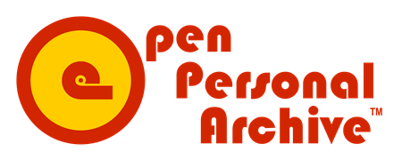

# [Open Personal Archive™](http://openpersonalarchive.com)

We created [Open Personal Archive™](https://github.com/vkehren/open-personal-archive) to address the pressing needs of Original Researchers of Primary Source Material as they perform research and prepare to use their research in publications. Such researchers commonly generate terabytes (TBs) of files while performing research activities, later facing the daunting challenge of sifting through this information to use it as evidence in publications via direct citations, while often wishing to retain control over who is allowed to actually access the underlying resources.

To empower researchers to search, use, and cite their own research more effectively, we designed Open Personal Archive™ to offer the following benefits:

1. Real-time private archiving of media files (e.g. text, audio, video, images, etc.)
2. Flexible encoding of subject-specific searchable information
3. Advanced search functionality that empowers users to find specific resources quickly and intuitively using easy to understand search criteria and syntax
4. Seamless creation of publicly reviewable citations for use in publications, with the option to grant access to the underlying resources on a case-by-case basis

To accomplish this, we built Open Personal Archive™ as an easily deployable Web Application built on the Google Firebase cloud development platform. This deployment model ensures that each researcher who uses Open Personal Archive™ has complete control over their own private deployment, including direct access to all uploaded content and files via their own Google Firebase management console that is tied to their own Google account.

If you wish to apply Open Personal Archive™ to your own research, you may simply download our code and deploy it to your own Google Firebase project (please see our [Install Guide](./docs/InstallGuide.md) for instructions as to how to do this).

Furthermore, if you wish to learn more about what Open Personal Archive™ is and how it works, please read our design documents:

1. [Schema Overview](./docs/SchemaOverview.md)
2. [Visual Overview](./docs/VisualOverview.md)
3. [Functional Overview](./docs/FunctionalOverview.md)

Finally, if you wish to adapt Open Personal Archive™ to better suit your own unique needs, you may do so, as well, under the flexible [MIT License](./LICENSE) under which we released our code. If you do so, we encourage you to share such changes with our team so that we may have the option to integrate your changes into the main code base for Open Personal Archive™.

Contributors: [Veronica Ehrenreich](https://github.com/vkehren), [Ryan Stephen Ehrenreich](https://github.com/rehrenreich)

Copyright © 2021 Open Personal Archive™
