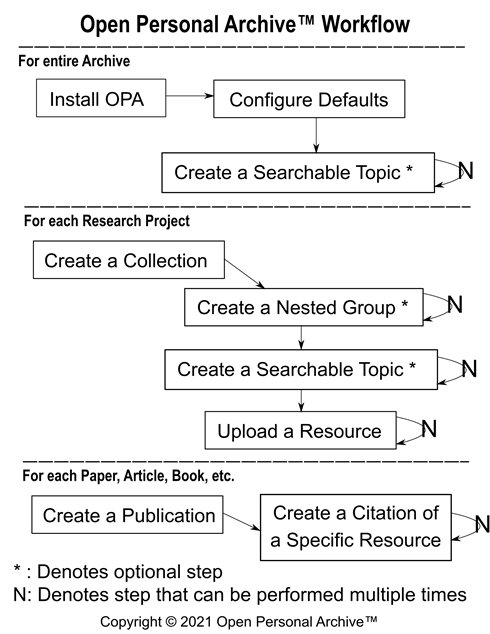

# Open Personal Archive™ Functional Overview

The Open Personal Archive™ (OPA) system was designed from the ground up to support the value propositions mentioned in the [OPA Project README](../README.md), namely:

1. Real-time private archiving of media files (e.g. text, audio, video, images, etc.)
2. Flexible encoding of subject-specific searchable information
3. Advanced search functionality that empowers the user to find specific contents much more quickly using easy to understand search criteria
4. Seamless creation of publicly reviewable citations for use in publications

To explain these value propositions in more detail requires first explaining how the OPA system works from a functional perspective based on three main areas of activity:

1. Adding information to the Archive
2. Searching for information stored in the Archive for use in academic works
3. Citing information used in such works flexibly and securely

This document seeks to do just this, to explain these areas of activity below.

# **Adding Information to the Archive**

The Workflow diagram below explains the discrete phases of adding information to an OPA archive, namely:

1. Adding configuration and setup information (including searchable Topic structure)
2. Creating Collections and uploading Resources to those Collections
3. Creating publicly viewable Citations for information used in Publications

While some of this functionality may be obvious, there are many unique aspects of the OPA system that researchers find useful. Particularly, unique aspects include the searchable Topic-Inquiry information assessed on Resources, the localization support for Resource files, the ability to extract the minimum necessary information from a Resource for a given Citration, and change management support that allows Users to rollback to prior Savepoints for Topics, Resources, and Citations.

For a visual treatment of these aspects, please see our [Visual Overview](./VisualOverview.md).

For more written explanation, please continue with this document.

LATER: Explain using the Archive to upload information, including: 
* Versioning
* File Management
* Localization (e.g. Localizable Text values and Localizable File Transcripts)
* Topic-Inquiry assessments

# **Searching for Information in the Archive**

In addition to supporting direct entry of basic search terms, the OPA system will support the creation of advanced Queries using formula-style syntax, where the formula encodes an expression tree that uses basic values, properties of OPA system objects, and/or nested expressions as arguments to the root expression, such as the example:

> FORMULA = EXPRESSION_1( EXPRESSION_2( argument_1 ), argument_2 ) )

where the User can examine values and perform operations on intermediate search results prior to determining the final search results.

As the OPA hierarchy of Archive-Collection-Group-Resource clearly provides a detailed folder structure, the OPA search functionality will support an "IN( path )" query operator that searches a specific path in the archive. In specifying the PATH for the IN operator to search, Users will be able to directly specify specific text values, use wildcard indicators, and use tree-navigation operators, as well. For instance, a User could specify the query:

> IN("My Collection"/*/Africa/DOWN(3)/UP(1)/South/PREVIOUS(2)/NEXT(1))

which would search in any folder that is alphabetically one position before a folder named "South" that is nested two levels (i.e. 3-1=2) under any Group named "Africa" whose parent Group in directly under "My Collection".

Also, the OPA search functionality will support examining the specific fields of a Resource, Citation, or any other OPA system object for the purpose of determining results. For example, if the User wishes to query against the original creation date of a document that was scanned then uploaded to the Archive, that User could specify the query:

> Resource."Origination Date" == "1964"

which would search for any documents contained in the Archive that were originally created in 1964.

Additionally, the OPA search functionality will also support a number of other useful constructs, such as:
* Metadata and Data lookup operators such as "NAMEOF(field-name, optional-object-path)" and "VALUEOF(field-name, optional-object-path)" (e.g. for obtaining name-of-type, name-of-user, parent-of-topic, description-of-inquiry, origination-date-of-resource, url-of-citation)
* Traversal operators (e.g. IN, NOTIN, UP, DOWN, PREVIOUS, NEXT)
* Hierarchial operators that take in field-value-matching expressions (HASPARENT, HASCHILD, HASANCESTOR, HASDESCENDANT, HASSIBLING)
* Boolean logic operators (e.g. AND, OR, NAND, NOR, NOT, XOR)
* Comparison operators (e.g. ==, !=, \<, \<=, \>, \>=)
* Inquiry lookup operators based on a specific value's index in the list of selected values and/or based on a date-time for Inquiries that vary over time (e.g. value-at-index, value-at-date, value-at-date-index, date-range-for-value, etc.)
* Other operators and/or expressions that prove useful to Users of the OPA system

# **Citing for Information in the Archive**

LATER: Explain publishing externally visible Citations

Copyright © 2021 Open Personal Archive™
