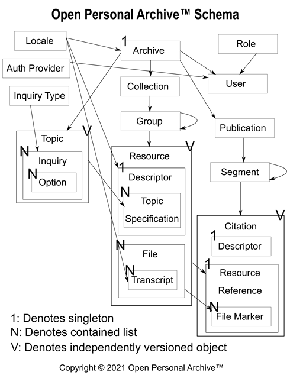

# Open Personal Archive™ Schema Overview

Below, we explain the document structure represented in the Open Personal Archive™ (OPA) Schema (including document types not explicity represented).

## **Data Types**

Below, we specify the types of fields using the list of data types supported in Google Firebase Firestore (i.e. string, number, boolean, map, array, null, timestamp, geopoint, and reference). It is worth noting that the type "map" is used to encode a JSON object.

Additionally, we also use the following extended types to denote specific schematic concerns:
* **_Address_**: This type represents the address of a specific place on the planet.
* **_TimeRange_**: This type represents a range of timestamps as text in the form "TR__\<timestamp1\>__\<timestamp2\>" where "timestamp1" must precede or equal "timestamp2". If the _TimeRange_ encodes a specific point in time (i.e. "timestamp1" equals "timestamp2"), it is allowable to omit the value for "timestamp2". Additionally, "MIN" and "MAX" are valid values for either timestamp, so long as these values are specified in a manner that maintains the rule that "timestamp1" must precede or equal "timestamp2".
* **_TimeRangePlaceInfo_**: This type represents the corresponsence between a TimeRange and Place (specified as an Address and/or geopoint), providing a "Notes" field for additional data.
* **_Nullable\<T\>_**: This type represents a base data type that should be allowed to take the value of _null_ as a valid value.
* **_Dictionary\<T\>_**: This type represents a _map_ that is used to provide key-value pairs, where the key is a _string_ and the value is of type _T_.
* **_Localizable\<T\>_**: This type represents a _Dictionary\<T\>_ where each key should specify a valid Locale OptionName or OptionBaseName (e.g. "en-US" or "en"). The values corresponding to OptionBaseNames will be used when a specific value does not exist for the desired OptionName (e.g. "en-US"), but does exist for the OptionBaseName (e.g. "en").
* **_TimeOrderable\<T\>_**: This type represents a _Dictionary\<T\>_ where each key should specify a valid _timestamp_ in text form.
* **_TimeRangeOrderable\<T\>_**: This type represents a _Dictionary\<T\>_ where each key should specify a valid _TimeRange_ in text form.

Also, to encode basic change tracking information, many of the document types below include the following fields:
* UserIdForCreation: _string_ (the ID of the User who created the document)
* DateOfCreation: _timestamp_ (the timestamp of when the document was created)
* UserIdForLatestUpdate : _string_ (the ID of the User who last updated the document)
* DateOfLatestUpdate: _timestamp_ (the timestamp of when the document was last updated)

## **Basic Document Types**

The document types listed below represent basic information provided in a freshly installed OPA database.

### **Locale**

The "Locale" document type is used to encode the list of Locale options supported by OPA for the purpose of localization. The default Locale is "en-US".

**Properties**
* Id: _string_ (unique system ID)
* OptionName: _string_ (name of the Locale in localization code, for example "en-US")
* OptionBaseName: _string_ (name of the language part of the Locale, for example "en")
* DisplayName: _string_ (name of the Locale to display in lists, for example "English (U.S.)")
* Display Order: _string_ (sortable value that determines placement in lists)
* IsDefault: _boolean_ (whether the Locale is the default Locale for the OPA system, where the default is "en-US")

### **TimeZone**

The "TimeZone" document type is used to encode the list of Time Zone options supported by OPA for the purpose of localization. The default TimeZone is "America/Los_Angeles".

**Properties**
* Id: _string_ (unique system ID)
* Name: _string_ (name of the TimeZone, for example "America/Los_Angeles")
* Display Order: _string_ (sortable value that determines placement in lists)
* IsDefault: _boolean_ (whether the TimeZone is the default TimeZone for the OPA system, where the default is "America/Los_Angeles")

### **ResourceType**

The "ResourceType" document type is used to encode the list of Resource Types supported by OPA. Currently, the list of values includes "Video", "Photo", "Document", "Scan", and "Notes".

**Properties**
* Id: _string_ (unique system ID)
* Name: _string_ (name of the ResourceType, for example "Video")
* Display Order: _string_ (sortable value that determines placement in lists)
* IsDefault: _boolean_ (whether the ResourceType is the default ResourceType for the OPA system, where the default is "Video")

### **FileType**

The "FileType" document type is used to encode the list of File Types supported by OPA. Currently, the list of values includes "txt", "png", "aac", "pdf", and "mpeg".

**Properties**
* Id: _string_ (unique system ID)
* Name: _string_ (name of the FileType, for example "Portable Document Format")
* Extension: _string_ (extension of the FileType, for example "pdf")
* Display Order: _string_ (sortable value that determines placement in lists)

### **FileMarkerType**

The "FileMarkerType" document type is used to encode the list of File Marker Type supported by OPA. Currently, the list of values includes "CharacterRange", "PixelRange", "PageRange", and "PlaybackRange", where the available set of values for a File are determined by the File's FileType. 

**Properties**
* Id: _string_ (unique system ID)
* Name: _string_ (name of the FileMarkerType, for example "Playback Range")
* RelevantFileTypeIds: _array_ (the FileType IDs to which a specific type of FileMarker applies, for example, "PlaybackRange" would apply to "aac" and "mpeg")
* Display Order: _string_ (sortable value that determines placement in lists)

### **InquiryType**

The "InquiryType" document type is used to encode the list of types of Inquiries supported by OPA. Currently, the list of values includes "Single-Select", "Multi-Select", and "Custom Value".

**Properties**
* Id: _string_ (unique system ID)
* Name: _string_ (name of the InquiryType, for example "Single-Select")
* Display Order: _string_ (sortable value that determines placement in lists)
* IsDefault: _boolean_ (whether the InquiryType is the default InquiryType for the OPA system, where the default is "Single-Select")

### **TimeUsageType**

The "TimeUsageType" document type is used to encode the list of options for displaying timestamps for Inquiry TimeRanges supported by OPA. Currently, the list of values includes "Year", "Year-Quarter", "Year-Month", "Date", and "Date-Time".

**Properties**
* Id: _string_ (unique system ID)
* Name: _string_ (name of the TimeUsageType, for example "Year")
* Display Order: _string_ (sortable value that determines placement in lists)
* IsDefault: _boolean_ (whether the TimeUsageType is the default TimeUsageType for the OPA system, where the default is "Year")

### **LoggedType**

The "LoggedType" document type is used to encode the list of types of document types for which modifications are logged by the OPA system. Currently, the list of values includes "User", "Archive", "Collection", "Group", "Topic", "Inquiry", "Resource", "Publication", "Segment", "Citation", and "File".

**Properties**
* Id: _string_ (unique system ID)
* Name: _string_ (name of the LoggedType, for example "Topic")
* Display Order: _string_ (sortable value that determines placement in lists)
* IsDefault: _boolean_ (whether the LoggedType is the default LoggedType for the OPA system, where the default is "Archive")

### **AuthenticationProvider**

The "AuthenticationProvider" document type is used to encode the list of OAuth providers supported for authenticating OPA User accounts. Initially, the list of supported OAuth providers will include Google, Microsoft, and Apple (and possibly others).

**Properties**
* Id: _string_ (unique system ID)
* Name: _string_ (name of the AuthenticationProvider)
* Display Order: _string_ (sortable value that determines placement in lists)

### **ActivityLogEntry**

The "ActivityLogEntry" document type is used to encode the recent activity of Users within the Archive to aid in integrity verification.

**Properties**
* Id: _string_ (unique system ID)
* UserId: _string_ (the ID of the active User)
* SearchQuery: _Nullable\<string\>_ (the query that was searched, if any)
* SearchedTypeIds:_Nullable\<array\>_ (the IDs of the LoggedTypes that were searched, if any)
* AccessedDocument: _Nullable\<map\>_ (the values necessary to lookup specific Document in OPA system)
  * LoggedTypeId: _string_ (the ID of the LoggedType corresponding to the type of document that was accessed)
  * DocumentId: _string_ (the ID of the document that was accessed)
  * DocumentVersionNumber: _Nullable\<string\>_ (the version number of the document that was accessed)
* ActivityType: _string_, allowed values: "list" | "search" | "view_summary" | "view_full" | "create" | "update" | "delete"
* DateOfCreation: _timestamp_

### **ChangeLogEntry**

The "ChangeLogEntry" document type is used to encode the recent modifications to the Archive to aid in integrity verification and presentation of recently added documents.

**Properties**
* Id: _string_ (unique system ID)
* UserId: _string_ (the ID of the User performing the modification)
* LoggedTypeId: _string_ (the ID of the LoggedType corresponding to the type of document that was modified)
* DocumentId: _string_ (the ID of the document that was modified)
* DocumentVersionNumber: _Nullable\<string\>_ (the version number of the document that was modified)
* ChangeType: _string_, allowed values: "create" | "update" | "delete"
* PreviousValue: _Nullable\<map\>_ (the value of the modified document BEFORE the modification)
* CurrentValue: _Nullable\<map\>_ (the value of the modified document AFTER the modification)
* DateOfCreation: _timestamp_

### **Role**

The "Role" document type is used to encode the list of Roles supported by OPA for the purpose of authorizing specific actions. Currently, the list of values includes "Owner", "Administrator", "Editor", "Viewer", and "Guest", where "Guest" accounts are only able to see Citations that they have been explicitly approved to view.

**Properties**
* Id: _string_ (unique system ID)
* Name: _string_ (name of the Role, for example "Owner")
* Display Order: _string_ (sortable value that determines placement in lists)
* IsDefault: _boolean_ (whether the Role is the default Role for the OPA system, where the default is "Guest")

### **User**

The "User" document type is used to encode the list of Users who are allowed to access the Archive. By default, the only User created will be the Owner, which will be set during installation. Post-installation, it will be possible to add more Users with the Roles of Editor or Viewer.

**Properties**
* Id: _string_ (unique system ID)
* AccountName: _string_ (the name of the account to use in OAuth authentication, usually an email address)
* AuthProviderId: _string_ (the ID of the AuthenticationProvider to use in OAuth authentication)
* AssignedRoleId: _string_ (the ID of the Role to which the User was assigned)
* ViewableCitationIds: _array_ (the IDs of the Citations to which the User has been granted direct access to view (i.e. access NOT through Role permissions))
* FirstName: _string_ (the first name of the User)
* LastName: _string_ (the last name of the User)
* PreferredName: _string_ (the name that the Archive should display for the User)
* LocaleId: _string_ (the LocaleId that should be used to localize text for the User)
* TimeZoneId: _string_ (the TimeZoneId that should be used to display date-time information to the User)
* RecentQueries: _TimeOrderable\<string\>_ (the list of recent queries for which the User has searched)
* DateOfCreation: _timestamp_
* DateOfLatestUpdate: _timestamp_
* ApprovalState: _string_, allowed values: "undecided" | "approved" | "denied"
* UserIdOfApprover: _Nullable\<string\>_
* DateOfApproval: _Nullable\<timestamp\>_

### **Archive**

The "Archive" document type is used to encode the configurable values specific to the Archive itself. These values are set during installation.

**Properties**
* Id: _string_ (unique system ID)
* Name: _Localizable\<string\>_ (the name of the Archive)
* Description: _Localizable\<string\>_ (the description of the Archive)
* OwnerId: _string_ (the ID of the User who is the Owner of the Archive)
* DefaultLocaleId: _string_ (the LocaleId that was set to the default for the Archive during installation)
* DefaultTimeZoneId: _string_ (the TimeZoneId that was set to the default for the Archive during installation)
* StoragePath: _string_ (the path to the root folder for file storage for the Archive)
* UserIdForCreation: _string_
* DateOfCreation: _timestamp_
* UserIdForLatestUpdate : _string_
* DateOfLatestUpdate: _timestamp_

## **Hierarchical and Descriptive Document Types**

The document types listed below represent the document types that encode hierarchical or descriptive values in the system. These documents types can be used to create custom criteria for searching across the contents of the archive.

### **Collection**

The "Collection" document type is used to encode the list of primary groupings of specific subsets of records in the Archive, where each primary grouping is often tied to a specific subject matter or research project.

**Properties**
* Id: _string_ (unique system ID)
* Name: _Localizable\<string\>_ (the name of the Collection)
* Description: _Localizable\<string\>_ (the description of the Collection)
* ArchiveId: _string_ (the ID of the parent Archive, included to allow potential for multiple Archives is a single database in the future)
* UserIdForCreation: _string_
* DateOfCreation: _timestamp_
* UserIdForLatestUpdate : _string_
* DateOfLatestUpdate: _timestamp_

### **Group**

The "Group" document type is used to encode the tree of secondary (and lower) groupings of specific subsets of Resources in a Collection.

**Properties**
* Id: _string_ (unique system ID)
* Name: _Localizable\<string\>_ (the name of the Group)
* Description: _Localizable\<string\>_ (the description of the Group)
* ArchiveId: _string_ (the ID of the parent Archive)
* CollectionId: _string_ (the ID of the parent Collection)
* ParentGroupId: _Nullable\<string\>_ (the ID of the parent Group, if the current Group is NOT a top-level Group)
* UserIdForCreation: _string_
* DateOfCreation: _timestamp_
* UserIdForLatestUpdate : _string_
* DateOfLatestUpdate: _timestamp_

### **Topic**

The "Topic" document type is used to encode the list of searchable criteria and values that Users dynamically create themselves. This document type is used in creating search functionality that extends beyond the capabilities provided by keywords.

**Properties**
* Id: _string_ (unique system ID)
* VersionNumber: _number_ (the number of the version of the document, starting at "1")
* Name: _Localizable\<string\>_ (the name of the Topic)
* Description: _Localizable\<string\>_ (the description of the Topic)
* ArchiveId: _string_ (the ID of the parent Archive)
* CollectionId: _Nullable\<string\>_ (the ID of the parent Collection, if _null_, then the Topic will appear across all Collections)
* ParentTopicId: _Nullable\<string\>_ (the ID of the parent Topic, if the current Topic is NOT a top-level Topic)
* ParentTopicVersionNumber: _Nullable\<number\>_ (the version number of the parent Topic, if the current Topic is NOT a top-level Topic)
* ForegroundColor: _string_ (the Foreground Color to use when displaying the Topic visually, for example "#000000ff" would encode black as the color of text)
* BackgroundColor: _string_ (the Background Color to use when displaying the Topic visually, for example "#80ffe6ff" would encode light-blue as the color of shape fill)
* Inquiries: _Dictionary\<Inquiry\>_ (the nested Inquiries for the Topic, where the key is the ID of the Inquiry)
  * Inquiry: _nested_document_type_
    * Id: _string_ (unique system ID)
    * Name: _Localizable\<string\>_ (the name of the Inquiry)
    * Description: _Localizable\<string\>_ (the description of the Inquiry)
    * InquiryTypeId: _string_ (the ID of the relevant InquiryType)
    * ForegroundColor: _string_ (the Foreground Color to use when displaying the Inquiry visually, for example "#000000ff" would encode black as the color of text)
    * BackgroundColor: _string_ (the Background Color to use when displaying the Inquiry visually, for example "#80ffe6ff" would encode light-blue as the color of shape fill)
    * Question: _Localizable\<string\>_ (the question to address for the Inquiry)
    * VariesByTime: _boolean_ (whether the answer should be a single value, or multiple values specified by TimeRange)
    * HasTimeBounds: _boolean_ (if the answers vary by time, should the TimeRange of the answers be bounded)
    * LowerTimeBound: _Nullable\<timestamp\>_ (the lower bound of the TimeRange, if null, then unbounded)
    * UpperTimeBound: _Nullable\<timestamp\>_ (the upper bound of the TimeRange, if null, then unbounded)
    * TimeUsageType: _string_ (the ID of the relevant TimeUsageType used to render TimeRanges as text)
    * DisplayTimeAsEarlierAboveLater: _boolean_ (configures whether to display ealier values above/before later values, or not)
    * Options: _Dictionary\<Option\>_ (the nested Options for the Inquiry, where the key is the ID of the Option, see note "*" below for more info)
      * Option: _nested_document_type_
        * Id: _string_ (unique system ID)
        * Value: _string_ (the value of corresponding to selecting the Option)
        * DisplayName: _Localizable\<string\>_ (the name to display for the Option)
* UserIdForCreation: _string_
* DateOfCreation: _timestamp_
* UserIdForLatestUpdate : _string_
* DateOfLatestUpdate: _timestamp_
* IsDeleted: _boolean_ (used to denote that a versioned object has been deleted)

\* NOTE: For a specific Inquiry, the list of Options is only editable if the InquiryType of the Inquiry is "Single-Select" or "Multi-Select". In such cases, the Options "irrelevant" and "uncertain" are always included, and "uncertain" is used as the default selection. Also, if the Inquiry has time bounds, the default selection will span the TimeRange corresponding to the entirety of the TimeBounds (e.g. if the Inquiry is only useful for the years 1900 to 2000, the default selection for the Inquiry will be "uncertain" across the entire TimeRange from 1900 to 2000).

## **Resource Document Types**

The document types listed below represent the document types that encode Resources in the system.

### **Resource**

The "Resource" document type is used to encode the list of Resource contained in the Archive, recorded under a Collection and Group(s). Each Resource contains searchable descriptive information in its Descriptor. Also, each Resource can contain multiple Files, where each file has the option to attach a language-specific Transcript (for example: OCR, translation of text document, transcription of audio as text).

**Properties**
* Id: _string_ (unique system ID)
* VersionNumber: _number_ (the number of the version of the document, starting at "1")
* Name: _Localizable\<string\>_ (the name of the Resource)
* Description: _Localizable\<string\>_ (the description of the Resource)
* ArchiveId: _string_ (the ID of the parent Archive)
* CollectionId: _string_ (the ID of the parent Collection)
* GroupId: _Nullable\<string\>_ (the ID of the parent Group, if _null_, then the Resource will appear at the Collection-level)
* ResourceTypeId: _string_ (the ID of the ResourceType that most accurately represents the contents of the set of Files within the Resource)
* Descriptor: _map_ (the descriptive values for the Resource)
  * Title: _Localizable\<string\>_ (the title of the Resource)
  * SubTitle: _Localizable\<string\>_ (the subtitle of the Resource)
  * HistoricalSubjects: _string_ (the subjects in history that the Resource is relevant to)
  * HistoricalPeriod: _TimeRange_ (the TimeRange of history that the Resource is relevant to)
  * Keywords: _string_ (the keywords that the Resource is relevant to)
  * Originators: _string_ (the people involved in creating the information)
  * OriginationInfo: _TimeRangeOrderable\<TimeRangePlaceInfo\>_ (the information for when and where the info in the Resource originated)
  * OriginationLanguages: _array_ (the list of languages relevant to when the info in the Resource originated)
  * Recorders: _string_ (the people involved in recording the information)
  * RecordingInfo: _TimeRangeOrderable\<TimeRangePlaceInfo\>_ (the information for when and where the info in the Resource was recorded)
  * RecordingLanguages: _array_ (the list of languages relevant to when the info in the Resource was recorded)
  * TopicSpecifications: _Dictionary\<TopicSpecification\>_ (the assessed Topic settings, where the key is the ID of the Topic)
    * TopicSpecification: _nested_document_type_
      * TopicId: _string_ (the ID of the assessed Topic)
      * TopicVersionNumber: _number_ (the version number of the assessed Topic)
      * InquirySpecifications: _Dictionary\<InquirySpecification\>_ (the assessed Inquiry settings, where the key is the ID of the Inquiry)
        * InquirySpecification: _nested_document_type_
          * InquiryId: _string_ (the ID of the assessed Inquiry)
          * Assessments: _TimeRangeOrderable\<InquiryAssessment\>_
            * InquiryAssessment: _nested_document_type_
              * StartTime: _timestamp_ (the start time of the InquiryAssessment's TimeRange)
              * EndTime: _timestamp_ (the end time of the InquiryAssessment's TimeRange)
              * SelectedOptionIds: _array_ (the list of selected OptionIds, if the type of the Inquiry is "Single-Select" or "Multi-Select")
              * CustomValue: _string_ (the text representation of the specified custom value (can be specified as text or JSON), if the type of the Inquiry is "Custom Value")
              * Notes: _string_ (the notes the User has provided to explain the assessment, if any)
* Files: _Dictionary\<File\>_ (the associated Files, where the key is the ID of the File)
    * File: _nested_document_type_
      * Id: _string_ (unique system ID)
      * Name: _Localizable\<string\>_ (the name to display for the File)
      * Description: _Localizable\<string\>_ (the description to display for the File)
      * FileTypeId: _string_ (the ID of the FileType for the File)
      * Path: _string_ (the path to the uploaded File stored in the server's file storage)
      * SequenceNumber: _number_ (the number of the File out of the complete set of Files to be uploaded for the Resource)
      * UserIdForUpload: _string_
      * DateOfUpload: _timestamp_
      * Transcripts: Localizable<TransciptFile>
        * TransciptFile: _nested_document_type_
          * Id: _string_ (unique system ID)
          * Path: _string_ (the path to the uploaded File stored in the server's file storage)
          * Language: _string_ (the name of the language in the file)
          * LocaleId: _Nullable<string>_ (the Locale of the language in the file, if the language is a modern language)
          * Name: _Localizable\<string\>_ (the name to display for the File)
          * Description: _Localizable\<string\>_ (the description to display for the File)
          * UserIdForUpload: _string_
          * DateOfUpload: _timestamp_
* UserIdForCreation: _string_
* DateOfCreation: _timestamp_
* UserIdForLatestUpdate : _string_
* DateOfLatestUpdate: _timestamp_
* IsDeleted: _boolean_ (used to denote that a versioned object has been deleted)

### **ResourceAccessRequest**

The "ResourceAccessRequest" document type is used to encode the list of requests to access particular resources. Currently, these requests are generated via attempts to access Citations, but they may be generated in other ways in the future.

**Properties**
* Id: _string_ (unique system ID)
* ArchiveId: _string_ (the ID of the parent Archive)
* RequestedResourceId: _string_ (the ID of the requested Resource)
* RequestingUserId: _string_ (the ID of the User requesting access)
* RelatedPublicationId: _string_ (the ID of the related Publication)
* RelatedCitationId: _string_ (the ID of the related Citation)
* HasBeenViewed: _boolean_
* UserIdForCreation: _string_
* DateOfCreation: _timestamp_
* UserIdForLatestUpdate : _string_
* DateOfLatestUpdate: _timestamp_
* ApprovalState: _string_, allowed values: "undecided" | "approved" | "denied"
* UserIdOfApprover: _Nullable\<string\>_
* DateOfApproval: _Nullable\<timestamp\>_

## **Citation Document Types**

The document types listed below represent the document types that encode a Citation of a Resource in the system.

### **Publication**

The "Publication" document type is used to encode the list of Publications (e.g. theses, books, journal articles, etc.) that use Resources from the Archive as evidence, particularly when such work cites the Resources used in a footnote or endnote.

**Properties**
* Id: _string_ (unique system ID)
* Name: _Localizable\<string\>_ (the name of the Publication)
* Description: _Localizable\<string\>_ (the description of the Publication)
* ArchiveId: _string_ (the ID of the parent Archive)
* UserIdForCreation: _string_
* DateOfCreation: _timestamp_
* UserIdForLatestUpdate : _string_
* DateOfLatestUpdate: _timestamp_

### **Segment**

The "Segment" document type is used to encode the tree of secondary (and lower) groupings of specific subsets of Citations in a Publication. Examples of Segment include: parts in a video or audio file, chapters or other front or back matter in a text file, or sub-sections of an visual work of art.

**Properties**
* Id: _string_ (unique system ID)
* Name: _Localizable\<string\>_ (the name of the Segment)
* Description: _Localizable\<string\>_ (the description of the Segment)
* ArchiveId: _string_ (the ID of the parent Archive)
* PublicationId: _string_ (the ID of the parent Publication)
* ParentSegmentId: _Nullable\<string\>_ (the ID of the parent Segment, if the current Segment is NOT a top-level Segment)
* UserIdForCreation: _string_
* DateOfCreation: _timestamp_
* UserIdForLatestUpdate : _string_
* DateOfLatestUpdate: _timestamp_

### **Citation**

The "Citation" document type is used to encode the list of Citations (e.g. footnotes, endnotes, credits, etc.) that use Resources from the Archive, where each Citation corresponds to a particular Resource.

**Properties**
* Id: _string_ (unique system ID)
* VersionNumber: _number_ (the number of the version of the document, starting at "1")
* Name: _Localizable\<string\>_ (the name of the Citation)
* Description: _Localizable\<string\>_ (the description of the Citation)
* ArchiveId: _string_ (the ID of the parent Archive)
* PublicationId: _string_ (the ID of the parent Publication)
* SegmentId: _Nullable\<string\>_ (the ID of the parent Segment, if _null_, then the Citation will appear at the Publication-level)
* ResourceId: _string_ (the ID of the cited Resource)
* ResourceVersionNumber: _string_ (the version number of the cited Resource)
* Url: _string_ (the public URL that corresponds to this Citation)
* RequiresApproval: _boolean_ (whether the owner of the Archive must approve access to view the Resource info connected to the Citation, if true, attempted access generates a ResourceAccessRequest)
* CitesEntireResource: _boolean_ (whether the Citation cites parts of the Resource using FileMarkers, or the complete Resource)
* Descriptor: _map_ (the descriptive values for the Citation)
  * CitationText: _Localizable\<string\>_ (the title of the Resource)
  * LATER: If it proves useful, replicate the TopicSpecification structure from the Resource document type here so that Citations can be searched using Topics & Inquiries
* FileMarkers: _Dictionary\<FileMarker\>_ (the associated FileMarkers, where the key is the ID of the FileMarker)
    * FileMarker: _nested_document_type_
      * Id: _string_ (unique system ID)
      * Name: _Localizable\<string\>_ (the name to display for the File)
      * Description: _Localizable\<string\>_ (the description to display for the File)
      * FileId: _string_ (the ID of the File in the Resource)
      * GeneratePartialFile: _boolean_ (whether to generate a partial File for the selected File using a partial Range, defaults to "true")
      * IncludeTranscripts: _boolean_ (whether to generate partial Transcripts for partial Files or include whole Transcripts for whole Files, defaults to "true")
      * MarkerNumber: _number_ (the number of the FileMarker out of the complete set of FileMarkers in the Citation)
      * PrimaryFileMarkerTypeId: _string_ (the primary FileMarkerType, where the set of valid options is determined by the FileType of the corresponding File)
      * PrimaryStartOfRange: _string_ (for example, if the primary FileMarkerType is "PlaybackRange", then an elapsed time marker for a video or audio file)
      * PrimaryEndOfRange: _string_ (for example, if the primary FileMarkerType is "PlaybackRange", then an elapsed time marker for a video or audio file)
      * SecondaryFileMarkerTypeId: _string_ (the secondary FileMarkerType, where the set of valid options is determined by the FileType of the corresponding File)
      * SecondaryStartOfRange: _string_ (for example, if the secondary FileMarkerType is "PixelRange", then a pixel range marker for a video file)
      * SecondaryEndOfRange: _string_ (for example, if the secondary FileMarkerType is "PixelRange", then a pixel range marker for a video file)
* UserIdForCreation: _string_
* DateOfCreation: _timestamp_
* UserIdForLatestUpdate : _string_
* DateOfLatestUpdate: _timestamp_
* IsDeleted: _boolean_ (used to denote that a versioned object has been deleted)

Copyright © 2021 Open Personal Archive™
