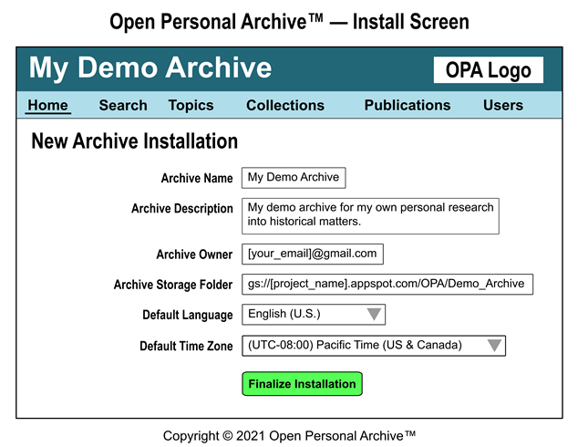

# Open Personal Archive™ Visual Overview

Below, we explain the features of the Open Personal Archive™ (OPA) system using screen mockups as visualization tools.

In these screens, the top bar displays the Archive name and the OPA logo. Below, the next menu bar displays links to the major screens that the User needs to accomplish tasks within the OPA system, where the underlined screen name corresponds to the current screen. In the screen contents, the purpose of most controls should be obvious from their labels, but it is worth noting that blue text in a Data Grid (or elsewhere) generally denotes a clickable link to another page.

Unless stated otherwise, each screen only allows access to authenticated Users who have been assigned a Role in the Achive by the Owner or an Administrator. The obvious exceptions to this rule are the Install Screen and the External Citation Access Screen.

Furthermore, the information presented in following screens corresponds to the most complete view, which is what the Archive Owner would see. It is possible that some information may be made read-only or hidden from view for Users who belong to lower-permissioned Roles, such as Editors and Viewers.

## **Install Screen**

Upon loading the OPA system code into one's own Google Firebase project, the OPA system will know that it is a new Archive. As such, it will ask the first authenticated User (using OAuth authenticated Google account) to configure the OPA installation and accept the Role of "Owner", thus granting this User complete control over this new Archive.

To complete the OPA installation, the Archive Owner must specify various configuration values necessary for the OPA system to store files and present localized information.

## **Home Screen**

Upon navigating to the URL for the Home screen for the OPA system, an authenticated User is presented with a summary of the Archive contents as well as the list of the latest Resources and Citations that have been created in the Archive.

To navigate to another screen, the User can use the menu bar or click on the name of a Resource or Citation listed in the Data Grids in the Home screen area.

## **Search Screen**

Upon navigating to the URL for the Search screen for the OPA system, an authenticated User is presented with the ability to use a Search Query (or Query) to locate specific Resources and Citations across the entire Archive (or for a subset of the Archive, if desirable).

The example depicted of "AND( Resource.Topic == "Independence" , Resource.Topic.Inquiry == "Date of Independence" , Resource.Topic.Inquiry.Value == "1952" )" shows a fairly complicated Query, formed using an Expression Tree. This depicts the type of functionality that we implement in the long-run.

However, in the short-run, the initial implementation of the OPA system may limit Query capabilities to basic keywords, locations within the Archive, and assessed Topic Inquiry (referred to as simply "Inquiry" henceforth) values for Resources and/or Citations in the Archive.

As the OPA codebase matures, we expect to implement:
* Metadata and Data lookup operators such as "NAMEOF(field-name, optional-object-path)" and "VALUEOF(field-name, optional-object-path)" (e.g. for obtaining name-of-type, name-of-user, parent-of-topic, description-of-inquiry, origination-date-of-resource, url-of-citation)
* Traversal operators (e.g. IN, NOTIN, UP, DOWN, PREVIOUS, NEXT)
* Hierarchial operators that take in field-value-matching expressions (HASPARENT, HASCHILD, HASANCESTOR, HASDESCENDANT, HASSIBLING)
* Boolean logic operators (e.g. AND, OR, NAND, NOR, NOT, XOR)
* Comparison operators (e.g. ==, !=, \<, \<=, \>, \>=)
* Inquiry lookup operators based on a specific value's index in the list of selected values and/or based on a date-time for Inquiries that vary over time (e.g. value-at-index, value-at-date, value-at-date-index, date-range-for-value, etc.)
* Other operators and/or expressions that prove useful to Users of the OPA system

## **Topics Screen**

Upon navigating to the URL for the Topics screen for the OPA system, an authenticated User is presented with the Topic Tree View (the hierarchy of Topics encoded within the Archive, with the ability to create and delete Topics, as necessary) on the left side of the screen and the Topic Editor (inputs for changing the Topics specified values) on the right side of the screen. Additionally, as Topic data is versioned so as to allow rollback in case of errors in changes to the current values, the screen provides "Record Savepoint" and "Revert to prior Savepoint" buttons.

As each Topic can contain any number of Inquiries, each existing Inquiry is presented as a row in a Data Grid (with the ability to create and delete Inquiries, as necessary). However, to edit a particular Inquiry, the "\[Edit\]" action must be clicked for that Inquiry, which causes a popup Inquiry Editor to appear.

At the bottom of the Inquiry Editor, the User manages the list of selectable Options. It is important to note that the Options "irrelevant" and "uncertain" will be added to the user-defined set of Options so that the OPA system can use predictable values as default selections.

For the Inquiry presented (i.e. "Unrest prior to Independence"), it is important to note that this Inquiry captures not only that unrest occurred, but the types of unrest that the country experienced. As most types of unrest are NOT mutually exclusive, the Inquiry is configured to allow the User applying this Inquiry to a Resource or Citation to choose more than one selection from the Options defined for the Inquiry.

Additionally, it is important to note that this Inquiry is also configured to allow the User applying this Inquiry to specify different selections across different Time Ranges related to the Resource. This is necessary, as the nature of unrest facing a country may change over time, and insurgencies may develop or fade away, depending on various situational factors. So by allowing the Inquiry to be applied for various Time Ranges within the Time Bounds defined (i.e. the colonial period prior to independence, specified as 1820-1950 in the screen mockup), the User of the Archive is able to record the most accurate information possible, enabling better quality Search Results across the set of data stored in the Archive.

## **Collections Screen**

Upon navigating to the URL for the Collections screen for the OPA system, an authenticated User is presented with the ability to view the contents of the Archive, drilling-down to a specific Collection or Group in a Collection, if desired, by using the Collection and Group selection inputs.

Additionally, the User can create and/or delete Collections and Groups, as necessary, by using the relevant buttons to do so. It is important to note that when creating a Collection, the User must provide a Name and Description via a popup editor. When creating a Group, the User must provide a Name, Description, and Parent Group (or NULL) via a popup editor. Also, when deleting a Collection or Group, that Collection or Group must be empty (i.e. both itself and nested Groups must NOT contain any Resources). If the Collection or Group is NOT empty, the deletion will be rejected as invalid by the OPA system.

Also, based on the configuration of the screen, the list of relevant Resources are displayed in a Data Grid at the bottom of the screen. This Data Grid provides a convenient way to select a particular Resource to display its contained information or to update that Resource, if necessary.

Finally, the "Upload New Resource" button allows the User to create a new Resource by taking the User to a specific Resource page for doing so (the Resource page is NOT listed in the Menu Bar). Upon creating a new Resource, that Resource may then show in the results in the Collections screen.

## **Resource Screen**

Upon navigating to the URL for the Resource screen for the OPA system, an authenticated User is presented with the ability to edit or delete the selected Resource, as well as generate a Citation that cites the selected Resource. Also, similar to the Topic screen, the Resource screen provides "Record Savepoint" and "Revert to prior Savepoint" buttons to to manage changes to the selected Resource.

The basic view of the Resource screen allows an authenticated User to define the Name, Desription and Type of the Resource; where in the Archive the Resource is located; and various metadata fields about how the Resource was created and to which subjects it has relevance.

Clicking the "Upload Files" button brings up the File Editor for the Resource.

The User can then choose which Files to upload for that specific Resource, easily adjusting the ordering of Files displayed in the OPA System, if necessary. In addition to uploading Files that directly comprise the Resource, the User can also upload language-specific Transcripts for each File (such as language-specific tranlations of a video or text document), so that such Transcripts are attached directly to the file to which they pertain.

Clicking the "Specify Topics" button brings up the Topic-Inquiry Editor for the Resource.

The User can then assess to which Topics and Inquiries the Resource has relevance. For Inquiries that do NOT vary by time, the Inquiry assessment row will show a single input for assessments (either as a Selection List or as a Text Entry, depending on the Inquiry Type of the Inquiry) and a single input for notes that explain the assessments.

However, when the Inquiry DOES vary by time, the Inquiry may show multiple assessments, each tied to a specific Time Range, where each Time Range corresponds to a single input for assessments and a single input for notes. Initially, only one single Time Range will appear, spanning the bounds for the Time Ranges specified when the Inquiry was created. If no bounds for the Time Ranges exist, the single Time Range will span from the MIN to the MAX value allowed for a timestamp allowed by the Google Firebase platform. Also, the screen will display these timestamps using the setting specified when the Inquiry was created, where the default behaviour is to display ONLY the year part of the Time Range values. Also, for any Time Range assessed, the lower value of the Time Range must precede or equal the upper value of the Time Range, and any edits that fail to meet this condition will be rejected by the OPA system.

To create more Time Ranges for additional assessments, the User must edit the lower value (which is by default displayed visually above the upper value) and/or upper value (which is by default displayed visually below the lower value) for a specific Time Range. The visual display of these values (earlier above later OR earlier below later) is configurable for the Inquiry.

When changing the lower value of a Time Range to a value less than its current value, the OPA system will shift the preceding Time Ranges that exist so that any Time Ranges that are completely encapsulated within the new bounds of the editted Time Range are deleted, and if a remaining Time Range is partially contained in the editted Time Range, the preceding Time Range will have its bounds shifted so its upper value matches the editted Time Range's new lower value, so that no TimeRange contains any portion of any other TimeRange for that Inquiry. When changing the lower value of a Time Range to a value greater than its current value, a new Time Range will be added to fill the gap in Time Ranges, with the assessments and notes of the newly added Time Range initialized by copying those of the editted Time Range. The behaviour for changing the upper value works similarly, but in reverse, so that decreasing the upper value creates a new Time Range and increasing the upper value shift the existing Time Ranges that follow chronologically. 

Also, a delete button (an "X" with a circle around it) is presented adjacent to each of the upper value and lower value of each Time Range, so that a Time Range when the User wishes to delete a TimeRange, that User may do so in such a manner as to make it clear whether to enlarge the previous or subsequent Time Range to encapsulate the deleted Time Range's bounds. The exception to this rule is the first and last Time Range displayed for a Inquiry, as the earliest Time Range cannot be merged with an earlier Time Range, as none exists. Similarly, the latest Time Range cannot be merged with a later Time Range, as none exists. This situation is clearly depicted in the screen image above, which clearly shows that when there are only two Time Ranges available, only two delete buttons show. Furthermore, if only one Time Range was available, no delete buttons would show, as the Time Range would encapsulate the entire bounds available, and hence be un-deletable. When a Time Range is deleted, the bounds of that Time Range are added to the Time Range that is adjacent to the delete button that was pressed, thus enlarging that adjacent Time Range to encapsulate the deleted Time Range.

For example, please refer to the screen image above. When the Inquiry displayed was originally applied to the Resource, the screen would have initially displayed a single Time Range of [1820 to 1950], without any delete buttons. The two Time Ranges displayed in the screenshot could have been created by the User either by changing the lower value of "1820" to "1900" or by changing the upper value of "1950" to "1900". Either of these changes would have resulted in the two Time Ranges displayed, namely [1820 to 1900] and [1900 to 1950], with delete buttons only displayed next to both occurrences of "1900". If the upper value of "1900" for the Time Range [1820 to 1900] was changed to "1860", then that Time Range would be changed to [1820 to 1860] and a third Time Range would be created for [1860 to 1900]. This new Time Range would display delete buttons next to both the lower value of "1860" and the upper value of "1900", as it would be valid to delete the new Time Range by shifting its bounds in either direction (i.e. earlier or later).

## **Publications Screen**

Upon navigating to the URL for the Publications screen for the OPA system, an authenticated User is presented with the ability to view the list of Citations for Publications associated with the Archive, drilling-down to a specific Publication or Segment in a Publication, if desired, by using the Publication and Segment selection inputs.

Additionally, the User can create and/or delete Publications and Segments, as necessary, by using the relevant buttons to do so. It is important to note that when creating a Publication, the User must provide a Name and Description via a popup editor. When creating a Segment, the User must provide a Name, Description, and Parent Segment (or NULL) via a popup editor. Also, when deleting a Publication or Segment, that Publication or Segment must be empty (i.e. both itself and nested Segments must NOT contain any Citations). If the Publication or Segment is NOT empty, the deletion will be rejected as invalid by the OPA system.

Also, based on the configuration of the screen, the list of relevant Citations are displayed in a Data Grid at the bottom of the screen. This Data Grid provides a convenient way to select a particular Citation to display its contained information, display its associated Resource information, or to update that Citation, if necessary.

Finally, the "Create New Citation" button allows the User to create a new Citation by taking the User to a specific Citation page for doing so (the Citation page is NOT listed in the Menu Bar). Upon creating a new Citation, that Citation may then show in the results in the Publications screen.

## **Citation Screen**

Upon navigating to the URL for the Citation screen for the OPA system, an authenticated User is presented with the ability to edit or delete the selected Citation. Also, similar to the Topic screen, the Citation screen provides "Record Savepoint" and "Revert to prior Savepoint" buttons to to manage changes to the selected Citation.

Editing can include changing which Resource it applies to, changing which Publication and/or Segment it applies to, changing its metadata, changing whether public access to the Citation must be approved on a case-by-case basis, and changing whether the Citation only applies to parts of the Resource (and if so, which parts specified as File Markers).

The User can also click "Generate Public Link" to create a public link to the Citation that can be shared with unauthenticated Users, which is particularly useful for the purpose of including links to the Citation in footnotes or endnotes of Publications. If approval is required to access the Citation (and its underlying Resource information), then each unique person who attempts to access the Citation via the public link will be prompted to submit an access request to actually view the Citation.

Clicking the "Specify File Markers" button brings up the File Marker Editor for the Citation.

The User can then choose which Files out of those included in the Resource should also be included in the Citation. For each included File, the User can also specify whether to include the whole File or only specific parts of the File, as well as whether to include Transcripts for that included File, as well. The User can also re-order the included Files, if need be, and generate a Preview of each included File, as well.

If only parts of the Resource are included as information to support the Citation, then the OPA system will use the specified File Markers to extract video clips, partial page ranges of documents, or partial areas of images, leaving the remaining information in the Resource private to the Archive.

## **Citation Screen (Public View)**

Upon navigating to the URL for a specific Citation in the OPA system, an anonymous User (i.e. unauthenticated User) is presented with the ability to request access to the Citation data and Resource data associated with specified Citation (only if the Citation requires approval before viewing underlying Resource data)

If the Citation requires approval before viewing, upon submitting a request to view the underlying data, the Archive Owner and Administrators would be notified, and could view the request in the OPA system. If desirable, they could contact the anonymous User prior to approving the request to determine whether to do so.

Once the Archive Owner or an Administrator approves the request, the anonymous User will be allowed access using the credential provided in the request.

## **Users Screen (Archive Owner View)**

Upon navigating to the URL for the Users screen for the OPA system, an authenticated User is presented with the ability to view and update their account information, if desired.

Additionally, the Archive Owner and the Administrators of the Archive can view and update the Role assigned to each User accounts in the OPA system. Also, for Guests of the Archive who have requested access to Citations (and their underlying Resources), the Owner and Administrators can approve or deny those Citation access requests.

Copyright © 2021 Open Personal Archive™
